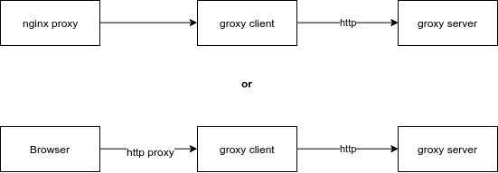

# Groxy

Client-server application that can work as an HTTP proxy server

## Features

* SSL encryption of traffic between the client and the server
* can work as an HTTP proxy server (not HTTPS)

## How it works



## Build

```
git clone https://github.com/toolsparty/groxy
cd groxy
go build client
go build server
```

##Example of use

nginx configuration (ex. /etc/nginx/conf.d/groxy.conf)
```
server {
    listen 127.0.0.1:80;
    server_name web.archive.org archive.org;
    
    location ~ {        
        proxy_pass http://127.0.0.1:8090;
        proxy_http_version 1.1;
        proxy_set_header Upgrade $http_upgrade;
        proxy_set_header Connection 'upgrade';
        proxy_set_header Host $host;
        proxy_cache_bypass $http_upgrade;
    }
}

server {
    listen 127.0.0.1:443;
    server_name web.archive.org archive.org;
    
    ssl                     on;
    ssl_protocols           SSLv3 TLSv1;
    ssl_certificate         /etc/nginx/ssl/cert.pem;
    ssl_certificate_key     /etc/nginx/ssl/cert.key;   
    
    location ~ {        
        proxy_pass http://127.0.0.1:8098;
        proxy_http_version 1.1;
        proxy_set_header Upgrade $http_upgrade;
        proxy_set_header Connection 'upgrade';
        proxy_set_header Host $host;
        proxy_cache_bypass $http_upgrade;
    }
}
```

groxy config (conf/config.json)
```json
{
  "http_host": "localhost",
  "http_port": "8090",
  "https_host": "localhost",
  "https_port": "8098",
  "prefix": "",
  "logger": true,
  "encryption": {
    "key": "15e739684df2c0136bf7236b3ea17ee5",
    "iv": "bf7236b3ea17ee51"
  },
  "server": {
    "host": "11.22.33.44",
    "port": "18890"
  }
}
```

hosts (/etc/hosts)
```
...
127.0.0.1   archive.org
127.0.0.1   web.archive.org
```
